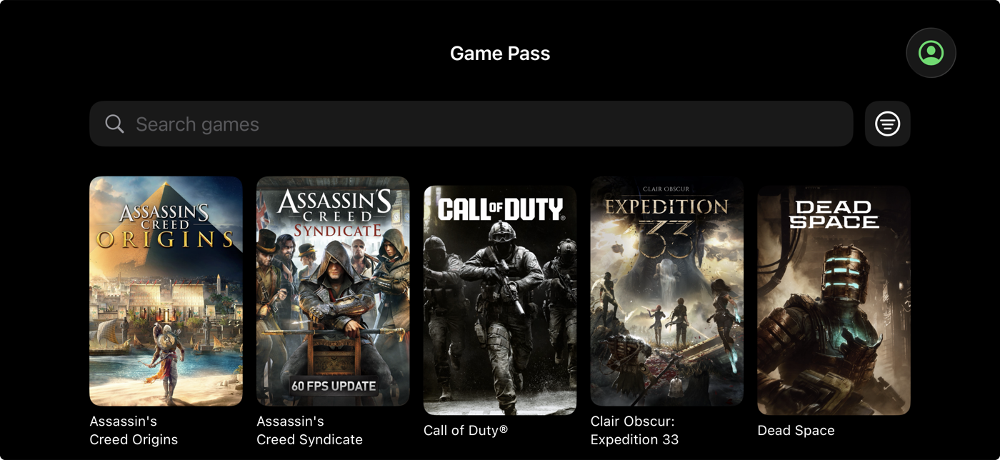
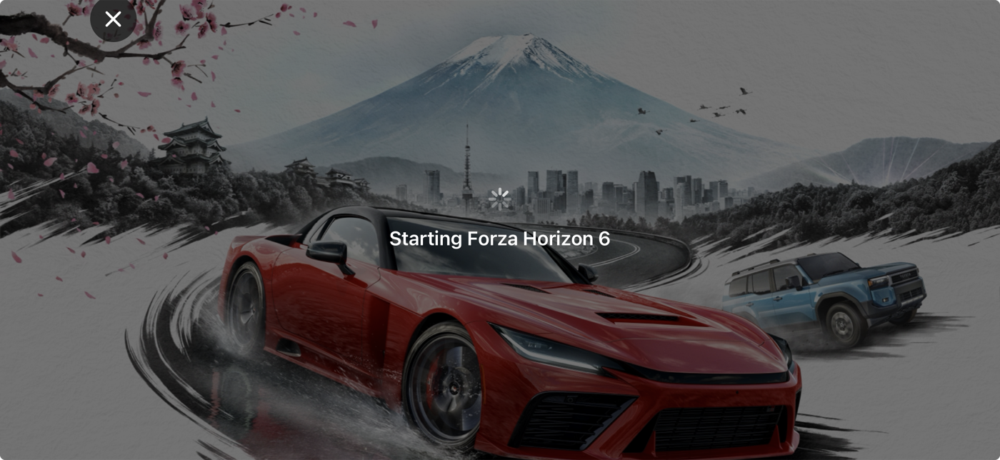

# RayxCloud

A native iPhone, iPad, and Mac app for Xbox Cloud Gaming. Sign in with your Microsoft account, pick a game from your Game Pass library, and play it full screen with a Bluetooth controller.

It exists for one reason: on iOS the only official way to play xCloud is Safari, and Safari keeps its address bar on screen. RayxCloud is a plain native app, so the game gets the whole display. As a side effect the picture is much better than the browser gets: the app negotiates the stream directly and receives 1080p, while the browser client on Apple devices is served a lower tier.

You build it yourself with Xcode and install it on your own device with your own Apple developer account. There is no App Store listing, no prebuilt download, and no signing service.

<p>
  
  
</p>

## Disclaimer

RayxCloud is an unofficial, community project. It is not affiliated with, endorsed by, or supported by Microsoft, Xbox, or Apple. Xbox, Game Pass, and Xbox Cloud Gaming are trademarks of Microsoft Corporation.

The software is provided as is, without warranty of any kind. You use it entirely at your own risk. The authors and contributors accept no legal responsibility for anything that results from using it, including but not limited to account restrictions, service interruptions, or violations of any terms of service you have agreed to. It may stop working at any time if Microsoft changes its service. Read the Xbox terms of service and decide for yourself before using it.

This project was built to get rid of the browser address bar while playing, nothing more.

## What you need

- A Mac with Xcode 26 or newer
- An Apple developer account. A paid account gives you a one-year certificate. A free account works too but the app has to be reinstalled every 7 days. For the Mac app any account works, including free ones.
- An iPhone or iPad on iOS 17 or newer, or a Mac on macOS 14 or newer
- A Microsoft account with an active Xbox Game Pass Ultimate subscription
- A Bluetooth controller paired to the device. Xbox, PlayStation, and MFi controllers all work. There are no on-screen touch controls yet.

## Build and install

There are two targets in the project: `RayxCloud` for iPhone and iPad, and `RayxCloudMac` for the Mac. They share all of the code.

1. Clone this repo and open `RayxCloud.xcodeproj` in Xcode.
2. Select the `RayxCloud` target (or `RayxCloudMac`), then the Signing & Capabilities tab.
3. Pick your team under Signing. If Xcode says the bundle identifier is not available, change `com.raylabsstudio.rayxcloud` to something of your own, for example `com.yourname.rayxcloud`.
4. Plug in your iPhone or iPad, choose it as the run destination, and press Run. For the Mac, pick My Mac as the destination.
5. On an iPhone or iPad, the first launch will be blocked until you trust your certificate: Settings, General, VPN & Device Management, tap your developer account, tap Trust.

If you prefer the command line:

```
# iPhone and iPad
xcodebuild -project RayxCloud.xcodeproj -scheme RayxCloud \
  -destination 'generic/platform=iOS' \
  -allowProvisioningUpdates DEVELOPMENT_TEAM=YOURTEAMID build

# Mac
xcodebuild -project RayxCloud.xcodeproj -scheme RayxCloudMac \
  -destination 'platform=macOS' DEVELOPMENT_TEAM=YOURTEAMID build
```

The Xcode project is generated from `project.yml` with [XcodeGen](https://github.com/yonaskolb/XcodeGen). You only need XcodeGen if you change `project.yml`; run `xcodegen generate` afterwards.

## Using it

1. Tap **Sign in with Microsoft**. On iPhone and iPad a Microsoft page opens inside the app with your device code already filled in. On the Mac it opens in your browser. Log in, then come back to the app.
2. Your Game Pass library loads. Use the search field or the filter button next to it (recently played, touch-capable titles, catalog features, sort order).
3. Tap a game. On iPhone and iPad the stream opens full screen in landscape. On the Mac it fills the window; use the full-screen button in the stream controls, or the green window button.
4. Tap or click anywhere on the stream to show the controls: close, performance overlay, and on the Mac, full screen.
5. The performance overlay is off by default. Toggle it with the gauge button. It shows resolution, frame rate, bitrate, round-trip latency, and packet loss.
6. Audio plays through the speaker, wired headphones, or Bluetooth audio.

iOS shows the orange microphone indicator while streaming and asks for microphone permission the first time. That is because WebRTC opens a play-and-record audio session. Nothing from the microphone is sent anywhere; you can deny the permission and audio still plays. Removing this is on the to-do list.

## Known limitations

- No touch controls. You need a physical controller.
- No Remote Play from your own console yet, even though the code for it is present.
- Untested on iPad beyond the simulator.
- The Mac app is new. The stream path is identical to iOS, but expect rough edges in window handling.
- Stream quality is whatever Microsoft's servers decide to send. On a good connection that is 1080p at 30 or 60 fps.

## How it works

The app is a port of [Stratix](https://github.com/nafields/stratix), an open-source Xbox Cloud Gaming client for Apple TV. Stratix implements the whole xCloud protocol in Swift: Microsoft device-code sign-in, Xbox Live token exchange, session provisioning, WebRTC signaling, the four data channels, and the 125 Hz gamepad input packets. All of that lives unchanged in the `Packages/` directory, apart from a handful of iOS fixes.

The `App/` directory is new and shared by the iOS and macOS targets: a SwiftUI shell for sign-in, library, and streaming, plus the WebRTC bridge and a video renderer built on AVSampleBufferDisplayLayer. WebRTC itself comes from the prebuilt [stasel/WebRTC](https://github.com/stasel/WebRTC) package.

```
App/            iOS and macOS app: SwiftUI views, WebRTC bridge, video renderer
Packages/       Stratix packages: XCloudAPI, StreamingCore, InputBridge, StratixCore, ...
Docs/           Stratix protocol and architecture notes (still accurate for the packages)
project.yml     XcodeGen spec for RayxCloud.xcodeproj
```

## Acknowledgements

This app would not exist without the people who reverse-engineered and documented the xCloud protocol in the open:

- [nafields/stratix](https://github.com/nafields/stratix) by nafields. The Swift implementation of the entire xCloud client that RayxCloud is built on. Its git history is preserved in this repo.
- [unknownskl/xbox-xcloud-player](https://github.com/unknownskl/xbox-xcloud-player) and [unknownskl/greenlight](https://github.com/unknownskl/greenlight) by unknownskl. The original TypeScript protocol library and desktop client that established how the session, SDP/ICE exchange, and input packets work. Stratix and therefore RayxCloud follow that work.
- [redphx/better-xcloud](https://github.com/redphx/better-xcloud) by redphx. The browser userscript whose research into device profiles, stream settings, and touch layouts informed the community's understanding of the service.
- [stasel/WebRTC](https://github.com/stasel/WebRTC) by stasel. Prebuilt Google WebRTC frameworks for iOS, updated with every Chromium release.
- [XcodeGen](https://github.com/yonaskolb/XcodeGen) by Yonas Kolb.

## License

RayxCloud is licensed under the GNU General Public License v3.0, the same license as Stratix. See [LICENSE](LICENSE). If you distribute a modified version, you must publish its source under the same terms.
